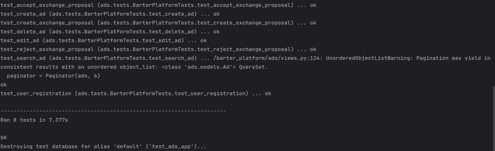

# Платформа для обмена вещами

Веб-приложение на Django + Django REST Framework, предназначенное для обмена вещами между пользователями.

---

## Основной функционал

- Регистрация и авторизация пользователей
- Создание объявлений с изображениями и категориями
- Просмотр и фильтрация объявлений
- Отправка и управление заявками на обмен
- Админ-панель для управления данными
- REST API для взаимодействия с фронтендом или мобильным приложением

---

## Запуск с помощью Docker

### 1. Клонировать репозиторий

```bash

git clone https://github.com/IWON0/barter-platform.git
cd barter_platform
```

### 2. Создать файл .env на основе env-sample

### 3. Построить и запустить контейнеры
```bash

docker-compose up --build
```

### 4. Готово
Приложение будет доступно по адресу:
http://localhost:8000

### Запуск тестов
```bash

docker-compose exec web python manage.py test
```

